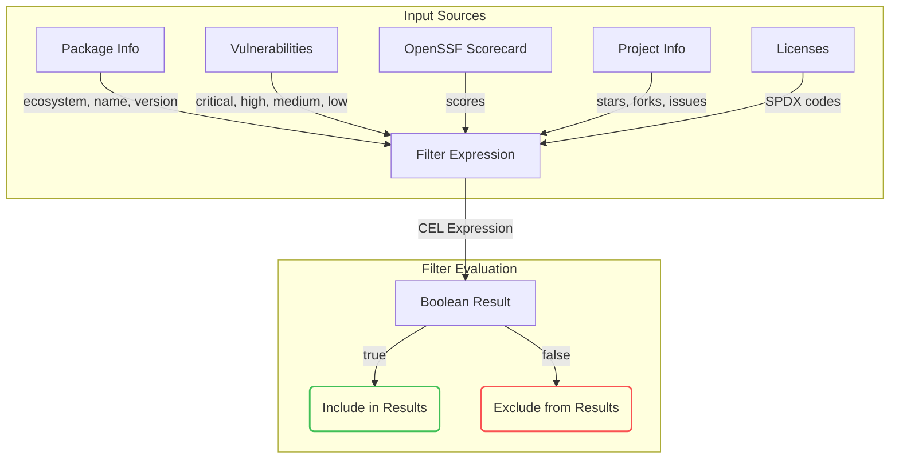

Filter commands help solve the problem of visibility for OSS dependencies in applications. To support various requirements, we adopt the generic [Common Expression Language (CEL)](https://cel.dev/) for flexible filtering.

## How Filtering Works



Filter expressions work on packages (dependencies) and evaluate to a boolean result. Packages are included in results when expressions evaluate to `true`.

## Quick Examples

### License Filtering

List only packages that use the MIT license:

```bash
vet scan -D /path/to/repo \
    --report-summary=false \
    --filter 'licenses.exists(p, p == "MIT")'
```

### Popularity Analysis

Find dependencies that appear unpopular:

```bash
vet scan --lockfiles /path/to/pom.xml --report-summary=false \
    --filter='projects.exists(x, x.stars < 10)'
```

### Vulnerability Detection

Find dependencies with critical vulnerabilities:

```bash
vet scan --lockfiles /path/to/pom.xml --report-summary=false \
    --filter='vulns.critical.exists(x, true)'
```

## Filter Input Structure

Filter expressions receive the following input data:

| Variable    | Content                                                     |
|-------------|-------------------------------------------------------------|
| `_`         | The root variable, holding other variables                  |
| `vulns`     | Map of vulnerabilities organized by severity               |
| `scorecard` | OpenSSF Scorecard metrics and scores                       |
| `projects`  | List of source projects associated with the package        |
| `licenses`  | List of licenses in SPDX license code format               |
| `pkg`       | Package information (ecosystem, name, version)             |

<Tip>
Refer to the [filter input specification](https://github.com/safedep/vet/blob/main/api/filter_input_spec.proto) for the detailed structure of input messages.
</Tip>

## Common Filter Expressions

### Security-Focused Filters

<Tabs>
  <Tab title="Vulnerability Checks">
    ```bash
    # Critical vulnerabilities
    vulns.critical.exists(x, true)
    
    # Any high or critical vulnerabilities
    vulns.critical.size() > 0 || vulns.high.size() > 0
    
    # More than 5 medium vulnerabilities
    vulns.medium.size() > 5
    
    # No known vulnerabilities
    vulns.critical.size() == 0 && vulns.high.size() == 0 && 
    vulns.medium.size() == 0 && vulns.low.size() == 0
    ```
  </Tab>
  
  <Tab title="Maintenance Checks">
    ```bash
    # Unmaintained packages (OpenSSF Scorecard)
    scorecard.scores.Maintained == 0
    
    # Overall OpenSSF Scorecard score
    scorecard.Score < 5
    ```
  </Tab>
  
  <Tab title="License Compliance">
    ```bash
    # GPL licenses
    licenses.exists(x, x == "GPL-2.0")
    
    # Approved licenses only
    licenses.exists(p, p in ["MIT", "Apache-2.0", "BSD-3-Clause"])
    
    # Exclude copyleft licenses
    !licenses.exists(p, p in ["GPL-2.0", "GPL-3.0", "AGPL-3.0"])
    
    # Unknown or missing licenses
    licenses.size() == 0
    ```
  </Tab>
</Tabs>

### Project Quality Filters

```bash
# Low popularity packages
projects.exists(x, x.stars < 100)

# High maintenance burden (many open issues)
projects.exists(x, x.issues > 500)

# Well-maintained projects
projects.exists(x, x.stars > 1000 && x.forks > 100)

# Community engagement ratio
projects.exists(x, x.forks > 0 && (x.stars / x.forks) > 5)
```

### Advanced Combination Filters

```bash
# High-risk packages
vulns.critical.size() > 0 && 
scorecard.scores.Maintained == 0 && 
projects.exists(x, x.stars < 50)

# Compliance violations
!licenses.exists(p, p in ["MIT", "Apache-2.0", "BSD-3-Clause"]) ||
vulns.high.size() > 0 ||
scorecard.Score < 3

# Production-ready packages
vulns.critical.size() == 0 &&
vulns.high.size() == 0 &&
scorecard.scores.Maintained > 5 &&
projects.exists(x, x.stars > 500) &&
licenses.exists(p, p in ["MIT", "Apache-2.0"])
```

## Filter Input JSON Example

Understanding the structure helps create effective filters:

```json
{
  "pkg": {
    "ecosystem": "npm",
    "name": "lodash.camelcase",
    "version": "4.3.0"
  },
  "vulns": {
    "all": [],
    "critical": [],
    "high": [],
    "medium": [],
    "low": []
  },
  "scorecard": {
    "scores": {
      "Binary-Artifacts": 10,
      "Branch-Protection": 0,
      "CII-Best-Practices": 0,
      "Code-Review": 8,
      "Dangerous-Workflow": 10,
      "Dependency-Update-Tool": 0,
      "Fuzzing": 0,
      "License": 10,
      "Maintained": 0,
      "Packaging": -1,
      "Pinned-Dependencies": 9,
      "SAST": 0,
      "Security-Policy": 10,
      "Signed-Releases": -1,
      "Token-Permissions": 0,
      "Vulnerabilities": 10
    }
  },
  "projects": [
    {
      "name": "lodash/lodash",
      "type": "GITHUB",
      "stars": 55518,
      "forks": 6787,
      "issues": 464
    }
  ],
  "licenses": ["MIT"]
}
```

## Practical Use Cases

### Security Auditing

```bash
# Generate security report
vet scan -D . \
    --filter 'vulns.critical.size() > 0 || vulns.high.size() > 0' \
    --report-json security-issues.json

# Find packages needing immediate attention
vet scan -D . \
    --filter 'vulns.critical.size() > 0 && scorecard.scores.Maintained == 0' \
    --report-markdown urgent-issues.md
```

### License Compliance

```bash
# Check for license violations
vet scan -D . \
    --filter '!licenses.exists(p, p in ["MIT", "Apache-2.0", "BSD-3-Clause", "ISC"])' \
    --report-summary

# Find packages without license information
vet scan -D . \
    --filter 'licenses.size() == 0' \
    --report-json unlicensed-packages.json
```

### Quality Assessment

```bash
# Find low-quality dependencies
vet scan -D . \
    --filter 'projects.exists(x, x.stars < 100) && scorecard.scores.Maintained < 5' \
    --report-summary

# Identify potential supply chain risks
vet scan -D . \
    --filter 'scorecard.scores.Supply_Chain < 5 || scorecard.scores.Token_Permissions < 5' \
    --report-json supply-chain-risks.json
```

## Performance Tips

<AccordionGroup>
  <Accordion title="Optimize Complex Filters">
    - Place most selective conditions first
    - Use `&&` instead of nested conditions when possible
    - Avoid redundant checks in complex expressions
  </Accordion>
  
  <Accordion title="Use Appropriate Data Types">
    - Use `size()` for counting array elements
    - Use `exists()` for checking array membership
    - Use direct comparison for simple values
  </Accordion>
  
  <Accordion title="Batch Operations">
    - Combine multiple similar checks into single expressions
    - Use the query workflow for repeated filtering operations
    - Cache results using JSON dumps for multiple analyses
  </Accordion>
</AccordionGroup>

## CEL Language Quick Reference

### Common Functions

- `size()` - Get length of arrays or maps
- `exists(var, condition)` - Check if condition is true for any element
- `in` - Check membership in arrays or maps
- `contains()` - String contains check
- `startsWith()` / `endsWith()` - String prefix/suffix checks

### Operators

- `==`, `!=` - Equality comparison
- `<`, `<=`, `>`, `>=` - Numeric comparison  
- `&&`, `||` - Logical AND, OR
- `!` - Logical NOT
- `+`, `-`, `*`, `/` - Arithmetic operations

### Data Types

- `true`, `false` - Booleans
- `"string"` - Strings (double quotes)
- `123`, `45.67` - Numbers
- `["a", "b"]` - Arrays
- `{"key": "value"}` - Maps

<CardGroup cols={2}>
  <Card title="CEL Documentation" icon="book" href="https://cel.dev/">
    Complete Common Expression Language documentation
  </Card>
  <Card title="OpenSSF Scorecard" icon="shield-check" href="https://github.com/ossf/scorecard#checks-1">
    Learn about available scorecard checks and metrics
  </Card>
  <Card title="Build Your Own Queries" icon="search" href="/advanced/build-your-own-queries">
    Use filtering with the query workflow for better performance
  </Card>
  <Card title="Policy as Code" icon="file-code" href="/advanced/policy-as-code">
    Implement comprehensive policies using filter expressions
  </Card>
</CardGroup>