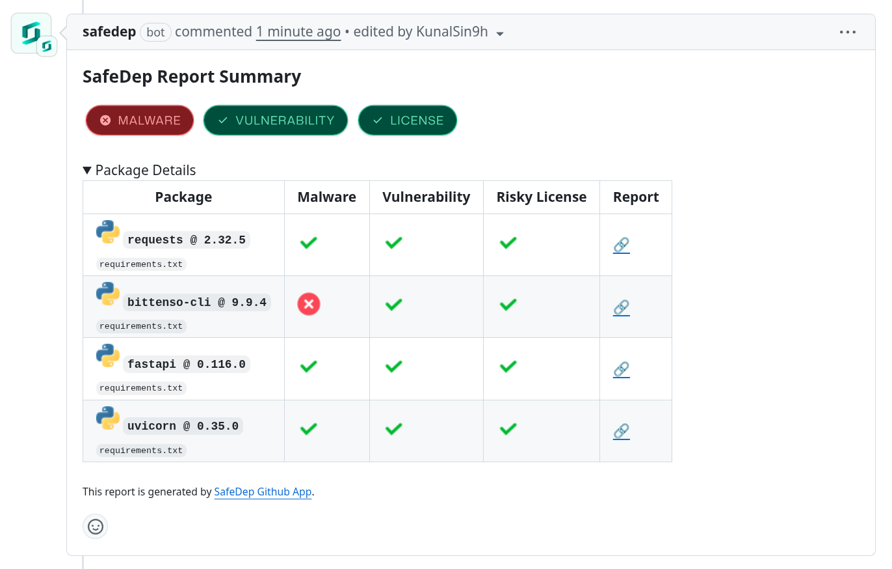
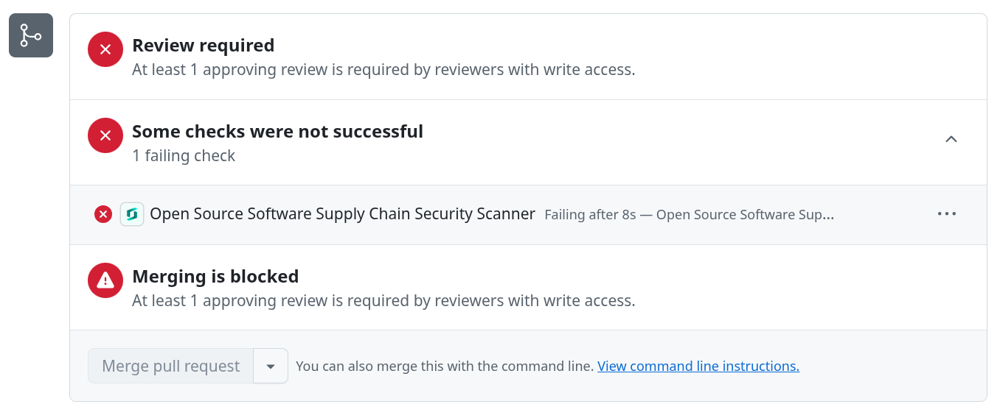

[SafeDep GitHub App](https://github.com/apps/safedep) integrates with your GitHub repositories to help you
manage your open source software supply chain. The advantage of using the app over SafeDep
[GitHub Action](https://github.com/safedep/vet-action) are:

- Zero configuration installation and immediate visibility of security findings in your repositories
- Protects against malicious open source packages
- Easy to use and get started without friction
- Provides optional [SafeDep Cloud](/cloud/) integration for centralized policy management and reporting

## How to Install

1. Navigate to [SafeDep GitHub App](https://github.com/apps/safedep)
2. Click _Install_
3. Follow the instructions to install the app in your GitHub organization or repository

## How to Use

SafeDep GitHub App automatically scans pull requests for open source dependency changes. Newly introduced
or updated dependencies are scanned for vulnerabilities and malware.

### Reports

On every **Pull Request**, SafeDep GitHub App scans the updated packages and creates a detailed list with analysis on:

- [Malicious / Suspicious](/cloud/malware-analysis)
- [Vulnerabilities](#appendix)
- [Risky Licenses](#appendix)

### Active Protection

Upon any failure to these reports the GitHub App **Check** will fail, protecting the branch from any harmful package.

## Appendix

- **Vulnerabilities**

  - The current version of _SafeDep GitHub App_ check for any `CRITICAL` AND `HIGH` risk vulnerability.
  - [OSV](https://osv.dev) is used as the vulnerability database

- **Risky Licenses**

  - The current version of _SafeDep GitHub App_ classify following licenses as **Risky**:

    - `GPL-2.0`
    - `GPL-2.0-only`
    - `GPL-2.0-or-later`
    - `GPL-3.0`
    - `GPL-3.0-only`
    - `GPL-3.0-or-later`
    - `LGPL-2.1`
    - `LGPL-2.1-only`
    - `LGPL-2.1-or-later`
    - `LGPL-3.0`
    - `LGPL-3.0-only`
    - `LGPL-3.0-or-later`
    - `AGPL-3.0`
    - `AGPL-3.0-only`
    - `AGPL-3.0-or-later`
    - `EPL-2.0`
