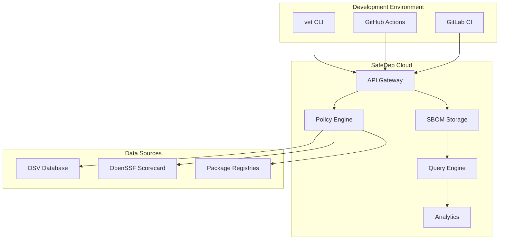

<Info>
SafeDep Cloud is currently in early preview. Contact [support@safedep.io](mailto:support@safedep.io) for enquiries about self-hosting options.
</Info>

## What is SafeDep Cloud?

SafeDep Cloud provides a **control and management plane** for managing open source software supply chain risks. It offers hosted services that augment [vet](https://github.com/safedep/vet) with additional capabilities and enterprise-grade integrations.

## How It Complements vet

While [vet](https://github.com/safedep/vet) is a powerful free and open source tool that can be used independently or integrated with CI/CD, large-scale deployments require additional capabilities:

<CardGroup cols={2}>
  <Card title="Centralized Policy Management" icon="shield-check">
    Manage, test, and deploy policies across all vet instances from a single location
  </Card>
  <Card title="Consolidated Reporting" icon="chart-bar">
    Aggregate findings from multiple repositories and teams for organization-wide visibility
  </Card>
  <Card title="SBOM Query Engine" icon="search">
    Query consolidated SBOMs across your entire software portfolio using SQL-like syntax
  </Card>
  <Card title="Malware Analysis" icon="virus">
    Enhanced threat detection capabilities beyond standard vulnerability scanning
  </Card>
</CardGroup>

## Key Features

### Enterprise Scale
- Support for 1000+ repositories
- Multi-tenant architecture
- Role-based access control

### Advanced Analytics
- Risk trending and metrics
- Policy violation tracking
- Component usage insights

### API-First Design
- RESTful APIs for integration
- Webhook support for real-time notifications
- CLI tools for automation

## Architecture

SafeDep Cloud acts as the central hub for all your vet deployments, providing unified policy management, data aggregation, and advanced querying capabilities.

## Getting Started

<CardGroup cols={2}>
  <Card title="Quick Start Guide" icon="rocket" href="/cloud/quickstart">
    Get up and running with SafeDep Cloud in minutes
  </Card>
  <Card title="Authentication Setup" icon="key" href="/cloud/authentication">
    Configure secure access to your SafeDep Cloud tenant
  </Card>
  <Card title="Visit SafeDep.io" icon="globe" href="https://safedep.io">
    Learn more about our solutions and pricing
  </Card>
  <Card title="Contact Sales" icon="envelope" href="mailto:support@safedep.io">
    Discuss enterprise requirements and custom deployments
  </Card>
</CardGroup>