# About vet

[vet](https://github.com/safedep/vet) is a free and open source tool for identifying risks in open source software supply chain. It helps security engineering teams to establish policy driven guard rails against risky OSS components.

## Architecture Overview

```mermaid
flowchart TD
    subgraph Config["🔧 Configuration"]
        A[Package Manifests]
        B[CEL Policies]
    end

    subgraph Analysis["🔍 Analysis Engine"]
        D[vet]
        E[["CEL Policy Engine"]]
        F[Insights]
    end

    subgraph Sources["📚 Trusted Sources"]
        G[OSV Database]
        H[OpenSSF Scorecard]
        I[deps.dev]
        J[Package Registries]
    end

    subgraph Cache["📚 Cache"]
        K[Cache]
    end

    %% Connections
    A --> D
    B --> E
    D --> F
    D --> E
    E --> F
    F --- K
    F --> Sources

    %% Styling
    classDef config fill:#6a0dad,stroke:#333,stroke-width:2px,color:white
    classDef analysis fill:#6a0dad,stroke:#333,stroke-width:2px,color:white
    classDef sources fill:#999,stroke:#333,stroke-width:1px
    classDef results fill:#6a0dad,stroke:#333,stroke-width:2px,color:white

    class A,B config
    class D,F analysis
    class E analysis,thick
    class G,H,I,J sources
    class K results
```

Vet automates the analysis of open source dependencies by combining insights from trusted sources and allowing developers to enforce custom security policies using CEL.

## vet in Action

    

## About SafeDep Cloud

SafeDep Cloud is a managed SaaS built using SafeDep Control Tower. It is meant for large scale `vet` deployments across 1000+ repositories, central policy management, integrated SBOM visualization, querying and other governance use-cases. 

<Card title="Get Started with SafeDep Cloud" icon="cloud" href="/cloud/quickstart">
  Scale vet across your organization with centralized policy management
</Card>