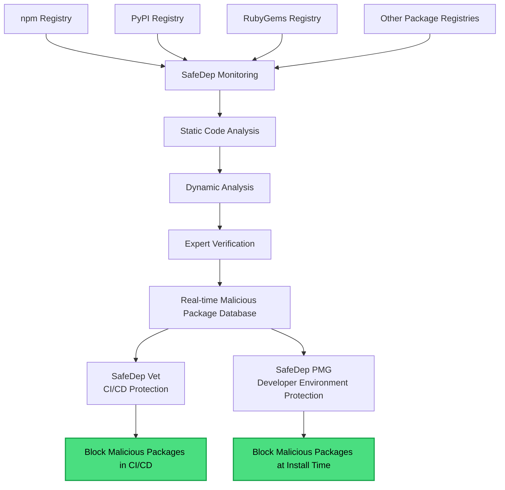

SafeDep continuously scans open-source packages for malicious code and turns the result into a real-time database that its tools use to block bad packages before they reach you.

## How detection works

SafeDep monitors public package registries (npm, PyPI, RubyGems, and more) and analyzes new and updated packages with a combination of:

- **Static analysis** of the package's code,
- **Dynamic analysis** of its runtime behavior (network, file system, and process activity),
- **Metadata analysis** of the package and its publisher.

Suspicious packages are verified by security experts before classification. The result feeds a real-time malicious package database that every SafeDep tool reads from.

## How SafeDep tools use it

- [Vet](/governance/vet/overview) blocks malicious packages in CI/CD.
- [PMG](/package-security/pmg/overview) blocks them at install time on developer machines.
- The [SafeDep MCP server](/ai-security/mcp-server) lets AI coding agents check a package before suggesting it.

## Related

<CardGroup cols={2}>
  <Card title="Malware Analysis" icon="shield-virus" href="/governance/cloud/malware-analysis">
    Analyze packages on demand in SafeDep Cloud.
  </Card>
  <Card title="PMG" icon="box" href="/package-security/pmg/overview">
    Block malicious installs locally.
  </Card>
  <Card title="Vet" icon="magnifying-glass" href="/governance/vet/overview">
    Block malicious packages in CI/CD.
  </Card>
  <Card title="Policy" icon="file-shield" href="/concepts/policy">
    Turn detection into enforceable rules.
  </Card>
</CardGroup>
