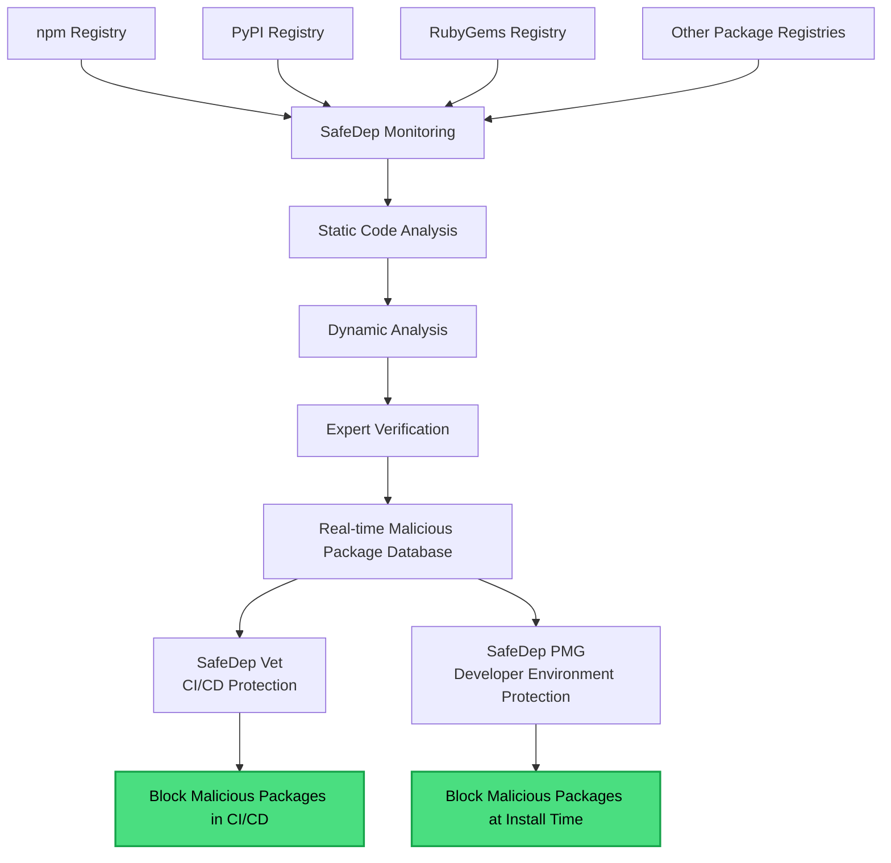

A malicious package is an open-source package built or altered to harm whoever installs it: stealing secrets, opening a backdoor, or running unwanted code. Unlike a [vulnerability](/concepts/vulnerability), which is an unintended flaw in an otherwise legitimate package, a malicious package is harmful by design.

## Common forms

- **Typosquatting and dependency confusion:** a package named to be mistaken for a popular or internal one.
- **Malicious install scripts:** code that runs the moment a package is installed, before you ever import it.
- **Backdoors and data exfiltration:** harmful behavior hidden inside otherwise working code.
- **Compromised releases:** malicious code injected into a previously trusted package, usually in a fresh version.

## How SafeDep detects them

SafeDep monitors public package registries (npm, PyPI, RubyGems, and more) and analyzes new and updated packages with:

- **Static analysis** of the package's code,
- **Dynamic analysis** of its runtime behavior (network, file system, and process activity),
- **Metadata analysis** of the package and its publisher.

Suspicious packages are verified by security experts before classification. The result feeds a real-time malicious package database that every SafeDep tool reads from.

## Blocking malicious packages

Detection is how SafeDep knows a package is malicious. Blocking it is the job of [Package Security](/package-security/overview):

- [PMG](/package-security/pmg/overview) blocks them at install time on developer machines.
- [Vet](/governance/vet/overview) blocks them in CI/CD.
- The [SafeDep MCP server](/ai-security/mcp-server) lets AI coding agents check a package before suggesting it.

## Related

<CardGroup cols={2}>
  <Card title="Vulnerability" icon="bug" href="/concepts/vulnerability">
    The other kind of dependency risk: unintended flaws in legitimate packages.
  </Card>
  <Card title="Package Security" icon="shield-halved" href="/package-security/overview">
    Block malicious packages at every entry point.
  </Card>
  <Card title="Malware Analysis" icon="shield-virus" href="/governance/cloud/malware-analysis">
    Analyze a package on demand in SafeDep Cloud.
  </Card>
  <Card title="Policy" icon="file-shield" href="/concepts/policy">
    Turn detection into enforceable rules.
  </Card>
</CardGroup>
