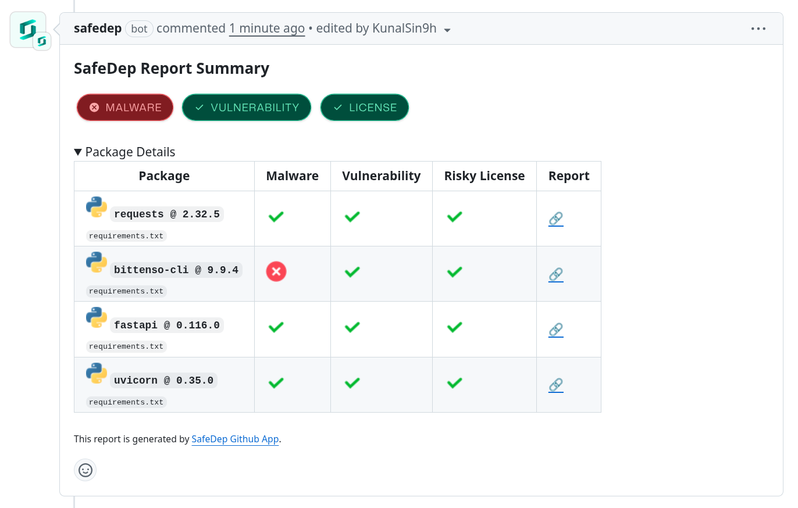
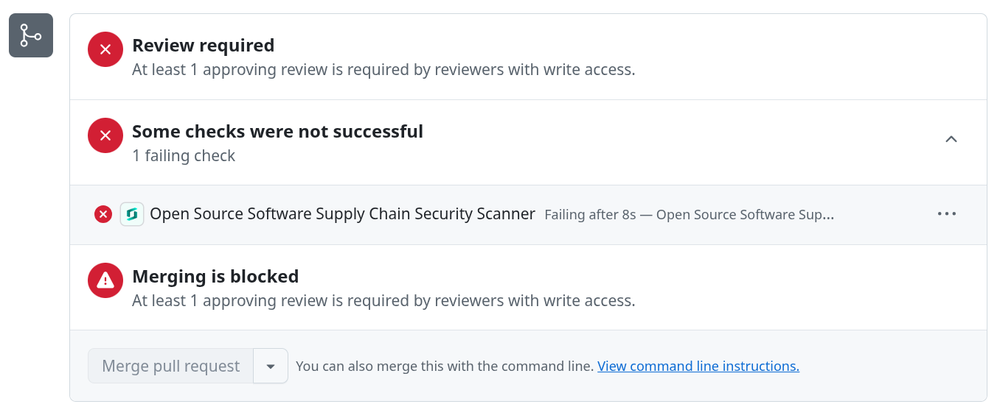

The [SafeDep GitHub App](https://github.com/apps/safedep) scans pull requests for supply-chain risk directly in GitHub. Unlike the [GitHub Action](https://github.com/safedep/vet-action), it requires no configuration and activates immediately after installation.

- Zero-configuration installation with immediate visibility of security findings
- Protects against malicious open source packages, known vulnerabilities, and risky licenses
- Free for public open source repositories. For private (commercial) repositories, it is intended to be used with a [SafeDep subscription](https://safedep.io/pricing)
- Optionally link the installation to a [SafeDep Cloud](/governance/cloud/overview) tenant for centralized policy and reporting

## How to Install

1. Navigate to [SafeDep GitHub App](https://github.com/apps/safedep)
2. Click _Install_
3. Follow the instructions to install the app in your GitHub organization or repository

## How to Use

The SafeDep GitHub App automatically scans pull requests for open source dependency changes. Newly introduced or updated dependencies are checked for vulnerabilities and malware.

### Reports

On every pull request, the app scans updated packages and reports on:

- [Malicious / Suspicious](/governance/cloud/malware-analysis)
- [Vulnerabilities](#appendix)
- [Risky Licenses](#appendix)

### Active Protection

When any report fails, the GitHub App **Check** fails and blocks the branch from merging.

The check fails if any _Verified Malicious Package_, _Vulnerability_, or _Risky License_ is found.

## Appendix

### Vulnerabilities

- Checks for `CRITICAL` or `HIGH` severity vulnerabilities.
- Uses [OSV](https://osv.dev) as the vulnerability database.

### Risky Licenses

- The app currently classifies the following licenses as **Risky**:

  - `GPL-2.0`
  - `GPL-2.0-only`
  - `GPL-2.0-or-later`
  - `GPL-3.0`
  - `GPL-3.0-only`
  - `GPL-3.0-or-later`
  - `AGPL-3.0`
  - `AGPL-3.0-only`
  - `AGPL-3.0-or-later`

### Supported Lockfiles

Supported lockfiles and ecosystems:
  1. **NPM**
  - `package-lock.json`
  - `pnpm-lock.yaml`
  - `yarn.lock`
  2. **GoLang**
  - `go.mod`
  3. **PyPI**
  - `requirements.txt`
  - `uv.lock`
  - `poetry.lock`
  - `Pipfile.lock`
  4. **RubyGems**
  - `Gemfile.lock`
  5. **Cargo (Rust)**
  - `Cargo.lock`
  6. **Packagist (PHP)**
  - `composer.lock`
  7. **Maven (Java)**
  - `pom.xml`
  - `gradle.lockfile`

<CardGroup cols={2}>
  <Card title="GitHub Code Scanning" icon="github" href="/governance/integrations/github-code-scanning">
    Surface vet findings in GitHub code scanning via SARIF.
  </Card>
  <Card title="Platform Integrations" icon="plug" href="/governance/integrations/overview">
    Wire vet into other CI/CD platforms.
  </Card>
  <Card title="vet Quickstart" icon="rocket" href="/governance/vet/quickstart">
    Scan a repository from the CLI.
  </Card>
  <Card title="Policy as Code" icon="file-code" href="/reference/policy-as-code">
    Define the policy the app enforces.
  </Card>
</CardGroup>
