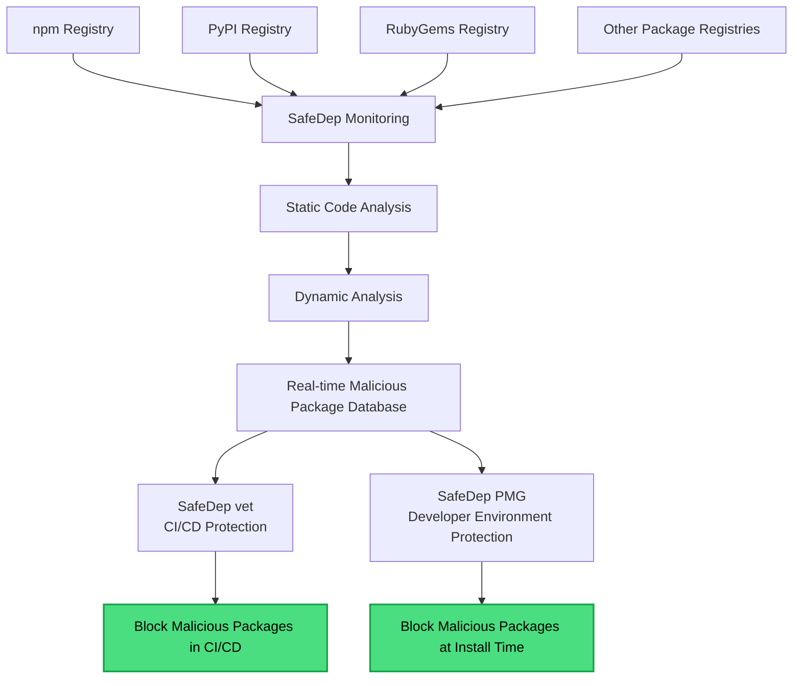

This is the official documentation website for [safedep.io](https://safedep.io).
Here you will find everything you need to know about using **SafeDep's open source tools** and
**SafeDep Cloud** to safeguard your applications against open source software supply chain risks.

---

## Why Open Source Security Matters

<Info>
**Did you know?** It has been estimated that Free and Open Source Software (FOSS) constitutes **70-90%** of any given piece of modern software solutions.
</Info>

With this level of dependency on open source, security teams need automated tools to safely consume OSS components without slowing down development velocity.

In 2026, open source usage is no longer limited to libraries. Adoption of [Agent Skills](https://agentskills.io) and community projects like [Clawhub](https://clawhub.ai) has extended open source software supply chain security risks to AI Agents.

## Open Source First

SafeDep is built on the belief that security tools should be **free, transparent, and accessible to everyone**.
Our core mission is to provide the security community with powerful open source tools that protect applications
from supply chain threats.

**Our Open Source Tools:**
- **[vet](https://github.com/safedep/vet)** - Supply chain security analysis for CI/CD pipelines
- **[pmg](https://github.com/safedep/pmg)** - Protect developers from malicious open source packages
- **[xBom](https://github.com/safedep/xbom)** - SBOM enriched with AI, Crypto and other metadata using static code analysis
- **[gryph](https://github.com/safedep/gryph)** - Audit trail for AI coding agents

These tools are completely free and built in public with community involvement. They operate independently and can be
used without any commercial relationship with SafeDep.

---

## How SafeDep Works

SafeDep is a cloud platform for end-end open source software supply chain security. At its core, SafeDep builds and operates a
large scale [malicious package scanning](#malicious-package-protection) infrastructure for real-time analysis of open source packages.

SafeDep open source tools are free to use and can be used independently of SafeDep Cloud. However, SafeDep provides a zero-friction,
unified platform experience for security teams to manage open source software supply chain risks across their entire SDLC.

**Start for free. Expand to SafeDep for a unified platform experience.** See [pricing](https://safedep.io/pricing/).

---

## Malicious Package Protection

SafeDep [continuously scans open source packages for malicious code](https://safedep.io/how-safedep-works/)
using a combination of static and dynamic analysis. Suspicious packages are verified by security experts to confirm malicious behavior.

Both our open source tools and SafeDep Cloud leverage this malicious package detection capability to provide
comprehensive protection against open source software supply chain risks.

<Info>
The diagram below shows how SafeDep works to protect your open source software supply chain
against malicious packages.
</Info>

---

## What's Next?

<CardGroup cols={2}>
  <Card
    title="Install SafeDep GitHub App"
    img="/images/github-app.png"
    href="/apps/github/overview"
  >
    Protect your GitHub repositories against malicious open source packages
  </Card>
  <Card
    title="Quick Start with vet"
    img="/images/vet-cta.png"
    href="/vet/quickstart"
  >
    Start identifying OSS risks using our free, open-source tool
  </Card>
  <Card
    title="Integration Guides"
    img="/images/integration-cta.png"
    href="/vet/guides/github-code-scanning"
  >
    Integrate with GitHub, GitLab, and other CI/CD platforms
  </Card>
  <Card
    title="Join Community"
    img="/images/community.jpg"
    href="https://discord.gg/kAGEj25dCn"
  >
    Connect with other security engineers and get support
  </Card>
</CardGroup>

---

