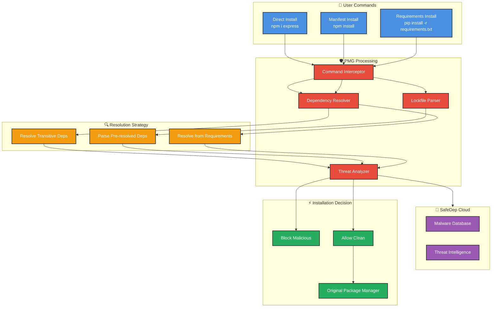

<Tip>
  Modern software development relies heavily on open source packages, but
  malicious actors increasingly target package repositories to distribute
  compromised code.
</Tip>

As the software supply chain becomes more complex, developers face growing risks from malicious packages that can compromise their development environments and applications. We need better tooling to protect developers from these threats at the point of installation.

## The Problem: Growing Supply Chain Threats

The open source ecosystem faces increasing threats from bad actors who publish malicious packages to popular repositories like npm, PyPI, and others. These threats include:

### Common Attack Vectors

- **Typosquatting attacks** where malicious packages mimic popular library names
- **Dependency confusion** attacks targeting private package names
- **Supply chain compromises** where legitimate packages are hijacked
- **Malicious packages** designed to steal credentials or inject backdoors

### Current Detection Gaps

Traditional security approaches only detect these threats after packages are already installed, often too late to prevent damage.

Most development teams rely on:

- Manual package review processes that don't scale
- Post-installation vulnerability scanning that misses many threats
- Static analysis tools that run after packages are already in the codebase
- Security policies that developers may forget to follow

This reactive approach leaves a dangerous window of vulnerability between package installation and threat detection.

## The PMG Solution: Real-Time Protection

PMG (Package Manager Guard) solves the problem of malicious package installation by providing **real-time protection** at the package manager level. It intercepts package installation commands and blocks malicious packages before they can be installed.

<CardGroup cols={2}>
  <Card title="Real-Time Protection" icon="shield-check">
    Block malicious packages before they're installed in your environment
  </Card>
  <Card title="Zero Configuration" icon="gear-complex">
    Works immediately without any setup or configuration changes
  </Card>
  <Card title="Seamless Integration" icon="plug">
    Transparent wrapper that works with your existing package managers
  </Card>
  <Card title="Threat Intelligence" icon="brain">
    Powered by SafeDep Cloud's continuously updated threat database
  </Card>
</CardGroup>

## Key Benefits

- **Proactive Security**: Stop threats before they enter your environment
- **Zero Friction**: No changes to your development workflow
- **Real-Time Intelligence**: Protection updates automatically as new threats are discovered
- **Deep Analysis**: Scans transitive dependencies to catch hidden threats
- **Developer Focused**: Minimal interruption for legitimate development work

## Why Now?

The threat landscape for software supply chains has evolved dramatically:

- **Scale of attacks**: Thousands of malicious packages published monthly
- **Sophistication**: Advanced techniques like dependency confusion
- **Impact**: Major breaches affecting enterprise and government systems
- **Speed**: Attacks spread faster than traditional detection methods

PMG provides the proactive defense needed to match the pace and scale of modern supply chain threats.

---

## About PMG

[SafeDep PMG](https://github.com/safedep/pmg) is a free and open source Package Manager Guard that protects developers from malicious packages by wrapping your favorite package managers and blocking dangerous packages at install time.

### Architecture Overview

PMG operates through two primary installation workflows, each with distinct dependency resolution strategies:

#### Workflow 1: Direct Package Installation

When users install individual packages directly:

```bash
npm install express
pip install requests
pnpm add lodash
```

**Process Flow:**
1. **Command Interception**: PMG intercepts the package manager command
2. **Dependency Resolution**: PMG resolves all transitive dependencies for the requested package
3. **Threat Analysis**: All packages in the dependency tree are analyzed for malware
4. **Installation Decision**: Clean packages proceed to installation, malicious packages are blocked

#### Workflow 2: Manifest File Installation

When users install from manifest files:

```bash
npm install          # Uses package-lock.json/pnpm-lock.yaml
pip install -r requirements.txt
```

**Process Flow for npm/pnpm:**
- **Lockfile Analysis**: Dependencies are already resolved in lockfiles (package-lock.json, pnpm-lock.yaml)
- **Direct Analysis**: PMG analyzes the pre-resolved dependency list
- **No Resolution Needed**: Skip dependency resolution step
- **Efficient Processing**: Faster analysis due to pre-resolved state

**Process Flow for pip (requirements.txt):**
- **Manual Resolution**: Dependencies are NOT pre-resolved in requirements.txt
- **Dependency Resolution**: PMG must resolve transitive dependencies for each package
- **Version Constraint Handling**: Processes version specifiers (>=, ==, ~=, etc.)
- **Complete Tree Building**: Builds full dependency tree similar to direct installs



**SafeDep PMG** intelligently adapts its analysis strategy based on the installation method, ensuring comprehensive security coverage while optimizing performance for different ecosystem patterns.

### Core Technical Components

#### 1. Command Interception Layer

PMG creates intelligent aliases for supported package managers:

```bash
# After pmg setup, these commands are automatically protected:
npm install express        #  Clean package - installs normally
npm install malicious-pkg  #  Blocked - malicious package detected
```

**Technical Implementation:**
- Shell alias creation for transparent command wrapping
- Cross-shell compatibility (bash, zsh, fish)
- Argument parsing and forwarding to maintain compatibility

#### 2. Dependency Resolution Engine

PMG employs different dependency resolution strategies based on the installation method:

**Strategy 1: Direct Package Installation Resolution**

For direct package installations (`npm install express`, `pip install requests`):

```
Your Package Request: express@^4.18.0
├── PMG Resolves Transitive Dependencies
│   ├── accepts@~1.3.8 (Clean)
│   ├── array-flatten@1.1.1 (Clean)
│   ├── body-parser@1.20.1 (Clean)
│   │   ├── bytes@3.1.2 (Clean)
│   │   ├── content-type@~1.0.4 (Clean)
│   │   └── debug@2.6.9 (Malicious - BLOCKED!)
│   └── cookie-signature@1.0.6 (Clean)
└── All packages analyzed before installation
```

**Resolution Process:**
- PMG queries package registries to build complete dependency tree
- Applies semantic versioning rules to resolve version ranges
- Considers peer dependencies and optional dependencies
- Builds complete manifest of all packages that would be installed

**Strategy 2: Manifest File Resolution**

**npm/pnpm Ecosystem (Pre-resolved Dependencies):**
```bash
npm install  # Uses package-lock.json
```

- **Lockfile Parsing**: Dependencies already resolved with exact versions
- **Direct Analysis**: PMG reads resolved dependency list from lockfiles
- **No Version Resolution**: Skip dependency resolution since versions are locked
- **Efficient Processing**: Faster analysis due to pre-resolved state

**Python Ecosystem (Requirements Resolution):**
```bash
pip install -r requirements.txt
```

- **Manual Resolution Required**: requirements.txt contains only direct dependencies
- **Transitive Resolution**: PMG must resolve all transitive dependencies
- **Version Constraint Handling**: Processes version specifiers (>=, ==, ~=, etc.)
- **Complete Tree Building**: Builds full dependency tree similar to direct installs

**Technical Implementation Details**

**Lockfile Format Support:**
- `package-lock.json`
- `pnpm-lock.yaml` (pnpm)
- Future: `yarn.lock` support planned

**Requirements Processing:**
```python
# requirements.txt example
requests>=2.25.0,<3.0.0
django==4.2.7
# -e git+https://github.com/user/repo.git  # Git URLs skipped
flask[async]  # Extra dependencies resolved
```

**Key Capabilities:**
- **Approximate Version Resolution**: Intelligently resolves version ranges (e.g., `^1.2.0`)
- **Semver Compatibility**: Understands semantic versioning rules
- **Peer Dependency Analysis**: Considers peer dependency requirements
- **Lock File Interpretation**: Respects existing lock file constraints

#### 3. Threat Detection System

PMG employs multiple detection mechanisms:

**Malicious Package Database**
- Continuously updated database of known malicious packages
- Real-time scanning of new packages as they're published
- Community-driven threat intelligence sharing

**Behavioral Analysis**
- Static analysis of package contents
- Detection of suspicious code patterns
- Identification of obfuscated malicious code

**Name-based Detection**
- Typosquatting pattern recognition
- Dependency confusion attack detection
- Suspicious naming convention analysis

### Supported Ecosystems & Limitations

**Currently Supported**

<CardGroup cols={2}>
  <Card title="Node.js Ecosystem" icon="node-js">
    **npm** and **pnpm** - Full protection for JavaScript packages from npmjs.org
  </Card>
  <Card title="Python Ecosystem" icon="python">
    **pip** - Protection for PyPI packages and dependencies
  </Card>
</CardGroup>

**Registry Scope Limitations**

**PyPI Focus**: For Python packages, pmg currently only analyzes packages from the PyPI registry. Packages installed from:
- Git URLs (`pip install git+https://...`)
- Local file paths (`pip install ./local-package`)
- Private registries (`pip install -i private-index`)
- Alternative indexes (`--extra-index-url`)

Are **not analyzed** for malware detection and will install normally.

**npm Registry Focus**: Similarly, for Node.js packages, PMG focuses on npmjs.org registry packages.

### Technical Considerations

**Version Resolution Accuracy**

PMG must make intelligent approximations about final package versions since it operates **before** package manager execution:

**Challenges:**
- Complex dependency resolution algorithms vary between package managers
- Version ranges can resolve differently based on existing dependencies
- Lock file states affect final resolution

**PMG's Approach:**
- Implements heuristic-based resolution that mirrors package manager behavior
- Prioritizes security over perfect version matching
- Continuously improves resolution accuracy based on real-world usage

<Warning>
  PMG uses approximate dependency resolution since it must evaluate packages **before** installation. While highly accurate, there may be edge cases where version resolution differs from the package manager's final resolution.
</Warning>

**Performance Characteristics**

PMG introduces minimal latency through:

1. **Network Requests**: API calls to SafeDep Cloud for threat intelligence
2. **Dependency Computation**: Local dependency tree analysis
3. **Threat Evaluation**: Package risk assessment

**Optimization Strategies:**
- Intelligent caching of threat intelligence data
- Parallel dependency analysis where possible
- Minimal network overhead through efficient API design

**Operating Modes**

PMG supports different operational modes for various scenarios:

```bash
# Silent mode - minimal output
pmg --silent npm install express

# Verbose mode - detailed analysis information
pmg --verbose npm install express

# Dry run - analyze without installing
pmg --dry-run npm install express

# Debug mode - comprehensive logging
pmg --debug --log /tmp/pmg.log npm install express
```

### Integration Patterns

**Development Environment Integration**
```bash
# One-time automated setup
pmg setup install

# Manual per-command usage
pmg npm install lodash
```

### Security Model

PMG operates on a **default-deny** security model for known threats:

- **Known malicious packages**: Blocked immediately with detailed warnings
- **Suspicious packages**: Prompt for user confirmation with a detailed report link for review
- **Verified clean packages**: Allowed without interference

This approach prioritizes **security over convenience** while maintaining usability for legitimate development workflows.
