## What is Policy as Code?

Policy as Code treats security policies as configuration files that can be evaluated by tools to make runtime decisions. This approach reduces the **cost of compliance** by automating the grunt work required to audit for policy violations.

## Why Use Policy as Code?

Manual verification and approval of new software components is tedious, error-prone, and incomplete. It's impossible to manually analyze a 3rd party dependency and all its transitive dependencies. Organizational software supply chain policies should be codified so tools can automatically evaluate every artifact for compliance.

### Common Policy Examples

<CardGroup cols={2}>
  <Card title="Vulnerability Policies" icon="shield-exclamation">
    Dependencies must not have known critical vulnerabilities
  </Card>
  <Card title="Maintenance Policies" icon="tools">
    Dependencies must be actively maintained
  </Card>
  <Card title="Popularity Policies" icon="users">
    Dependencies must have an extensive user base
  </Card>
  <Card title="Security Standards" icon="certificate">
    Publishers must follow security standards like SLSA
  </Card>
</CardGroup>

## How Filter Suites Work

```mermaid
flowchart LR
    subgraph "Policy Definition"
        A["👥 Security Team"] -->|Define| B[["Policy Rules"]]
        B -->|Convert to| C[["Filter Suite"]]
    end

    subgraph "Evaluation"
        D["👤 Developer"] -->|Add| E[["OSS Component"]]
        E -->|Scan| F[["vet"]]
        F -->|Check| C
        C -->|Match| G("❌ Blocked")
        C -->|No Match| H("✅ Allowed")
    end

    style G fill:transparent,stroke:#fa5252,stroke-width:2px
    style H fill:transparent,stroke:#40c057,stroke-width:2px
```



A Filter Suite allows you to combine multiple security policies into a single, comprehensive ruleset. Instead of writing individual filters, you can express complex organizational policies in a structured format.

## Example Filter Suite

Here's a comprehensive filter suite that implements common security policies:

```yaml
name: Enterprise Security Policy
description: Comprehensive security policy for open source components
filters:
  - name: critical-vulnerabilities
    value: |
      vulns.critical.size() > 0
    
  - name: high-vulnerabilities
    value: |
      vulns.high.size() > 5
    
  - name: approved-licenses
    value: |
      !licenses.exists(p, p in ["MIT", "Apache-2.0", "BSD-3-Clause", "ISC"])
    
  - name: minimum-maintenance
    value: |
      scorecard.scores.Maintained < 5
    
  - name: security-score
    value: |
      scorecard.Score < 3
  
```

## Using Filter Suites

### Basic Usage

Apply a filter suite to scan a project:

```bash
vet scan -D /path/to/project \
  --filter-suite /path/to/policy.yml \
  --filter-fail
```

### Directory Scanning

Scan multiple manifest files:

```bash
vet scan -D /path/to/monorepo \
  --filter-suite .vet/security-policy.yml \
  --filter-fail
```

### CI/CD Integration

Use filter suites in your CI pipeline:

```yaml
# GitHub Actions
- name: Security Policy Check
  uses: safedep/vet-action@v1
  with:
    policy: '.github/vet-policy.yml'
    fail-on-violation: true
```

## Advanced Policy Examples

### License Compliance Policy

```yaml
name: License Compliance
description: Ensure only approved licenses are used
filters:
  - name: copyleft-licenses
    value: |
      licenses.exists(p, p in ["GPL-2.0", "GPL-3.0", "AGPL-3.0"])
    
  - name: unknown-licenses
    value: |
      licenses.size() == 0 || licenses.exists(p, p == "UNKNOWN")
```

### Supply Chain Security Policy

```yaml
name: Supply Chain Security
description: Advanced supply chain security checks
filters:
  - name: unsigned-packages
    value: |
      !package.signed
    
  - name: suspicious-maintainers
    value: |
      package.maintainers.size() == 1 && 
      package.published_at > timestamp("2023-01-01T00:00:00Z")
    
  - name: typosquatting-risk
    value: |
      package.name.size() < 3 || 
      package.name.contains("_") && package.downloads < 1000
```

### Development vs Production Policies

<Tabs>
  <Tab title="Development Policy">
    ```yaml
    name: Development Policy
    description: Relaxed policy for development environments
    filters:
      - name: critical-vulns-only
        value: |
          vulns.critical.size() > 0
      
      - name: major-license-violations
        value: |
          licenses.exists(p, p in ["GPL-3.0", "AGPL-3.0"])
    ```
  </Tab>
  
  <Tab title="Production Policy">
    ```yaml
    name: Production Policy
    description: Strict policy for production deployments
    filters:
      - name: any-high-severity-vulns
        value: |
          vulns.critical.size() > 0 || vulns.high.size() > 0
      
      - name: maintenance-requirements
        value: |
          scorecard.scores.Maintained < 7
      
      - name: security-requirements
        value: |
          scorecard.scores.Security < 5
    ```
  </Tab>
</Tabs>

## Filter Suite Evaluation

Filter suites are evaluated as:
1. **Ordered list** of filters as defined in the suite file
2. **Stop on first match** for each package
3. **Return violation** if any filter matches

<Tip>
Order your filters from most specific to most general for optimal performance.
</Tip>

## Best Practices

<AccordionGroup>
  <Accordion title="Version Control Policies">
    Store your filter suites in version control alongside your code to ensure policy changes are tracked and reviewed.
  </Accordion>
  
  <Accordion title="Environment-Specific Policies">
    Use different policies for development, staging, and production environments with varying strictness levels.
  </Accordion>
  
  <Accordion title="Policy Testing">
    Test your policies against known good and bad packages before deploying to production.
  </Accordion>
  
  <Accordion title="Gradual Rollout">
    Start with warning-only mode before enforcing blocking policies to understand the impact.
  </Accordion>
</AccordionGroup>

## CEL Language Reference

The Common Expression Language (CEL) provides the foundation for writing policies. Key concepts:

### Available Data Fields

- `vulns.critical`, `vulns.high`, `vulns.medium`, `vulns.low` - Vulnerability arrays
- `licenses` - Array of license identifiers
- `scorecard.scores.*` - OpenSSF Scorecard metrics
- `package.*` - Package metadata (name, version, published_at, etc.)

### Common Operations

- `size()` - Get array length
- `exists(item, condition)` - Check if condition exists for any item
- `in` - Check membership in array
- `contains()` - String contains check

<CardGroup cols={2}>
  <Card title="CEL Documentation" icon="book" href="https://cel.dev/">
    Learn more about the Common Expression Language
  </Card>
  <Card title="Example Policies" icon="file-code" href="https://github.com/safedep/vet/tree/main/samples/filter-suites">
    Browse example filter suites in the vet repository
  </Card>
</CardGroup>