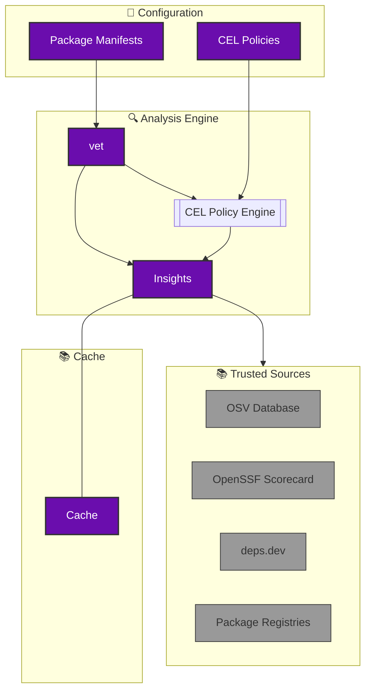

[SafeDep vet](https://github.com/safedep/vet) is a free and open source tool for identifying risks in open source software supply chain. It helps security engineering teams to establish policy driven guard rails against risky OSS components.

## Architecture Overview

**SafeDep vet** automates the analysis of open source dependencies by combining insights from trusted sources and allowing developers to enforce custom security policies using CEL.

## vet in Action

    

