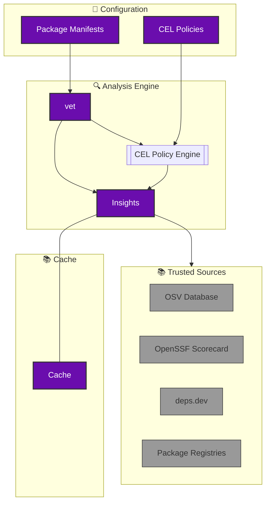

> It has been estimated that Free and Open Source Software (FOSS) constitutes 70-90% of any given piece of modern software solutions.
>
> [Source](https://www.linuxfoundation.org/blog/blog/a-summary-of-census-ii-open-source-software-application-libraries-the-world-depends-on)

Industry dependency on OSS will only increase. We need better tooling to help security engineering teams to safely consume OSS components.

## Problem

Product security practices secure software developed and deployed internally. They do not cover software consumed from external sources in form of libraries from the Open Source ecosystem. The growing risk of vulnerable, unmaintained and malicious dependencies establishes the need for product security teams to vet 3rd party dependencies before consumption.

## Current State

Vetting open source packages are largely a manual and opinionated process involving engineering teams as the requester and security teams as the service provider. A typical OSS vetting process involves auditing dependencies to ensure security, popularity, license compliance, trusted publisher etc. The manual nature of this activity increases cycle time and slows down engineering velocity, especially for evolving products.

## What is vet?

SafeDep vet is a free, open-source next-generation software composition analysis (SCA) tool.
It can be used in development, CI/CD, and production environments to protect against risky open source components
including vulnerabilities and malware. It is built in public at [safedep/vet](https://github.com/safedep/vet).

## What vet aims to solve

[vet](https://github.com/safedep/vet) solves the problem of OSS dependency vetting by providing a policy driven automated analysis of libraries. It can be seamlessly integrated with any CI tool or used in local environments.

<CardGroup cols={2}>
  <Card title="Automated Analysis" icon="robot">
    Replace manual dependency reviews with automated policy-driven analysis
  </Card>
  <Card title="Policy as Code" icon="file-code">
    Define and version control your security policies using CEL expressions
  </Card>
  <Card title="CI/CD Integration" icon="code-branch">
    Seamlessly integrate with any CI tool or development workflow
  </Card>
  <Card title="Trusted Sources" icon="shield-check">
    Leverage data from OSV, OpenSSF Scorecard, and other trusted sources
  </Card>
</CardGroup>

## Benefits

- **Reduced Cycle Time**: Eliminate manual review bottlenecks
- **Consistent Policies**: Apply the same security standards across all projects
- **Developer Velocity**: Enable teams to move fast while staying secure
- **Scalable Security**: Handle thousands of dependencies automatically

---

## About vet

[SafeDep vet](https://github.com/safedep/vet) is a free and open source tool for identifying risks in open source software supply chain. It helps security engineering teams to establish policy driven guard rails against risky OSS components.

### Architecture Overview

**SafeDep vet** automates the analysis of open source dependencies by combining insights from trusted sources and allowing developers to enforce custom security policies using CEL.

### vet in Action

    

